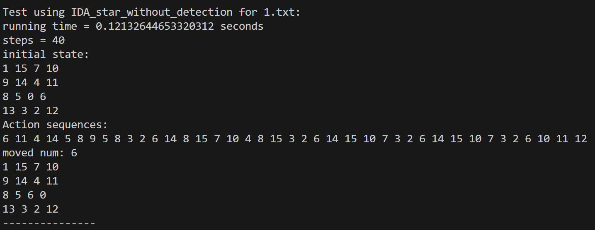

# 
五子棋--博弈树搜索 Alpha-beta 剪枝

## 效果展示

## 算法原理

### 实现结构

定义一个 Node 类，类中的成员变量为 state、parent、move、depth。其中 state 类型为`np.ndarray` ，保存节点棋盘的状态；parent 的类型为 `Node` ，保存该节点的父节点，目的是在找到目标解时向上回溯，从而打印出最优解的路径；move 是一个 `int` 类，用于记录该节点是将空格和哪个数字对调产生的；depth 记录了节点深度。

### A*算法

A*算法是一种启发式搜索算法，用于在图中找到从初始节点（初始状态）到目标节点（目标状态）的最短路径。它结合了最好优先搜索（Best-First Search）和 Dijkstra 算法的特点，通过评估函数 f(n) = g(n) + h(n)来选择路径，其中 g(n)是从初始节点到当前节点的实际代价，h(n)是启发式函数估计的从当前节点到目标节点的最小代价，这里选择节点的曼哈顿距离作为启发值。

为了实现该算法，维护一个优先队列 `open_list` ，保存所有可扩展的节点，利用其堆排序的特性，快速的弹出具有最小 `f(n)` 值的节点；同时维护一个集合 `closed_set` ，保存所有已经扩展过的节点，利用环检测的方法加快速度。该算法能够保证给出最优解，同时尽可能加快求解速度。

### IDA*算法

迭代加深 A*（IDA*）算法是一种结合了迭代加深搜索（Iterative Deepening Search, IDS）和 A 搜索算法特点的启发式搜索算法。它旨在解决如 15-puzzle 这样的路径寻找问题，同时减少内存消耗并尽可能找到最优解。用节点的评价值作为深度限制，每次循环如果遇到超出限制的节点，那么在下次循环时更新深度限制；如果所有节点都不超过限制，那么认为寻找完毕，找不到目标节点；如果找到目标节点则返回最终状态。利用节点的父指针向上回溯找到路径

## 代码运行
`python gobang.py --chess_file filename`